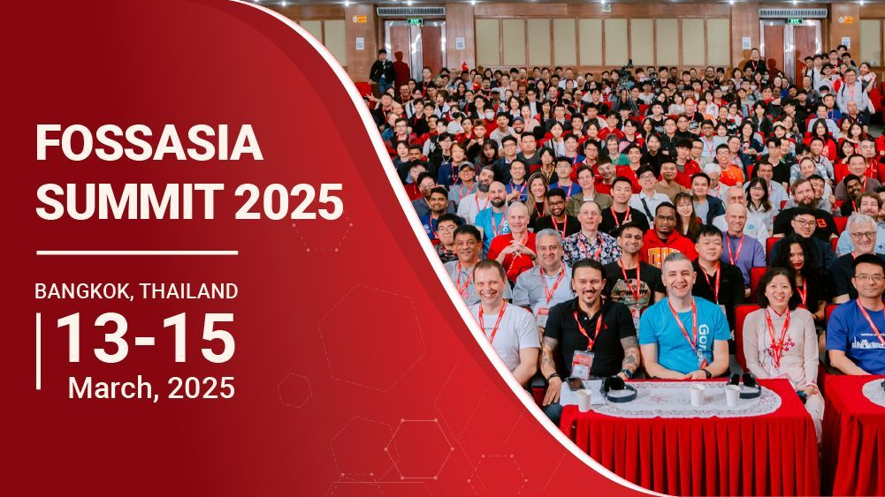
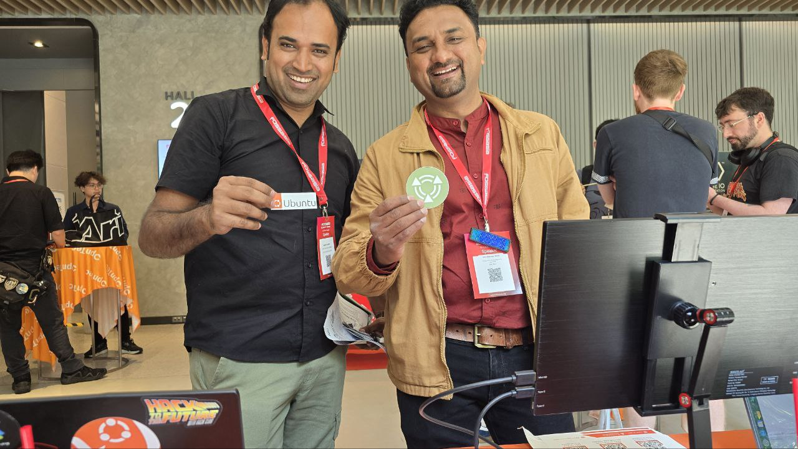
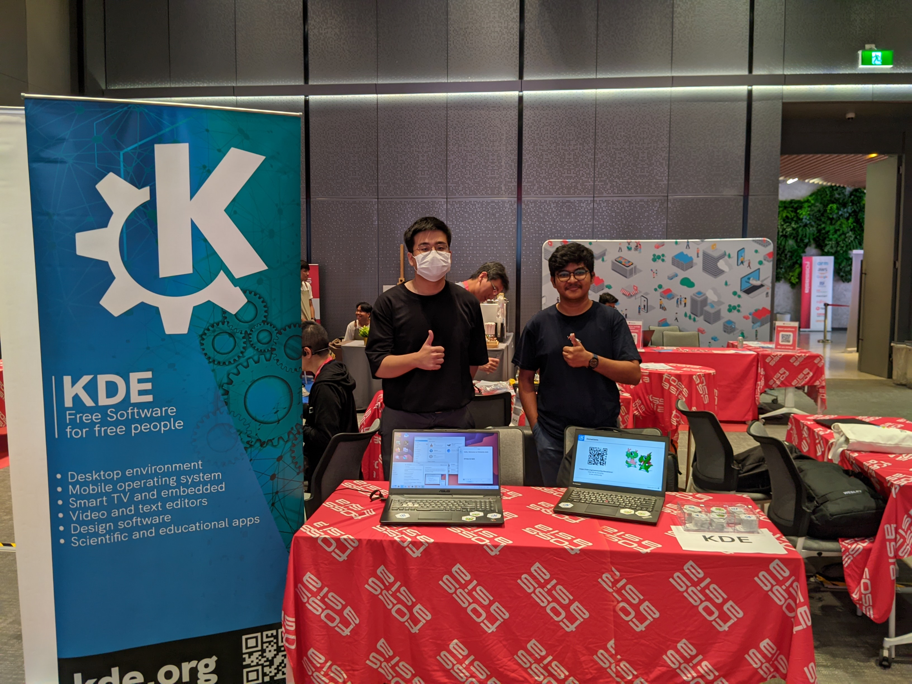
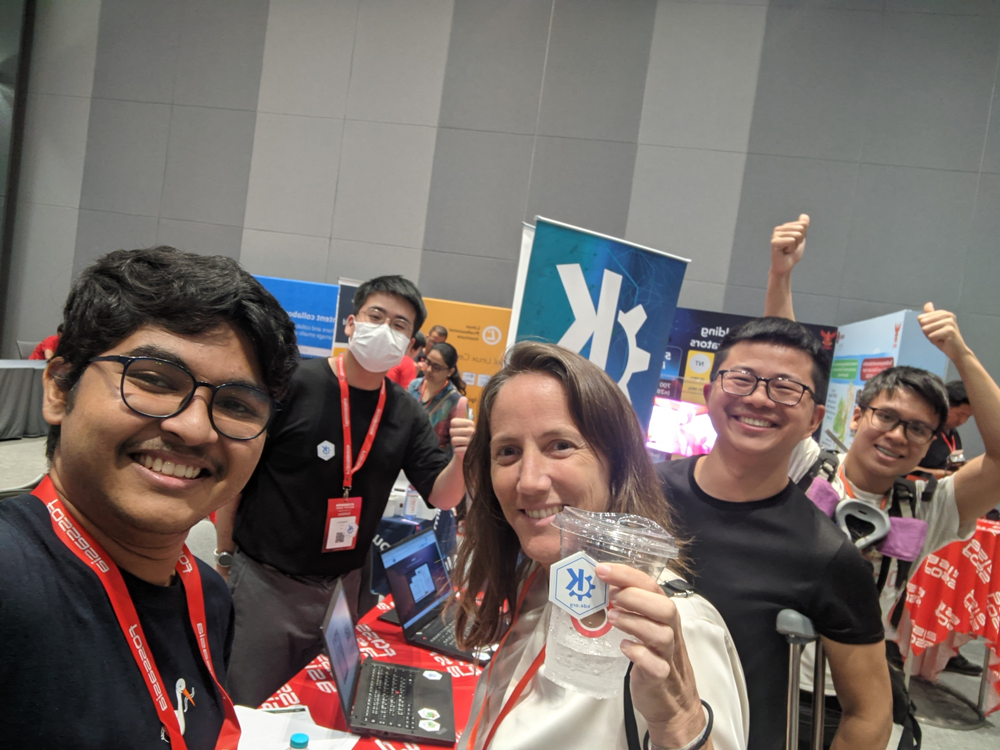
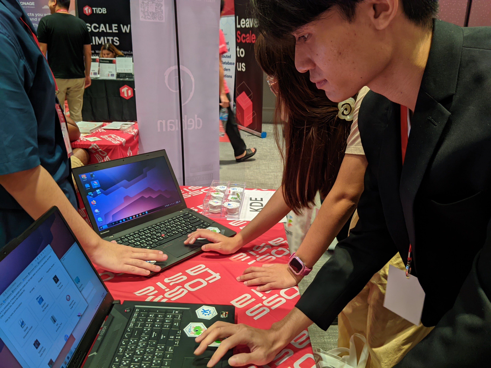
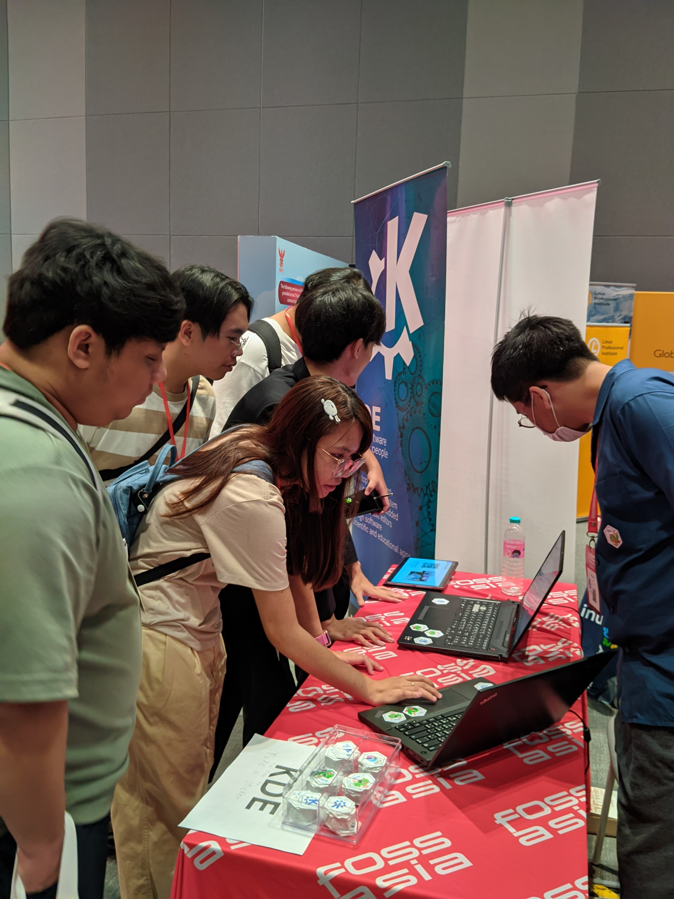
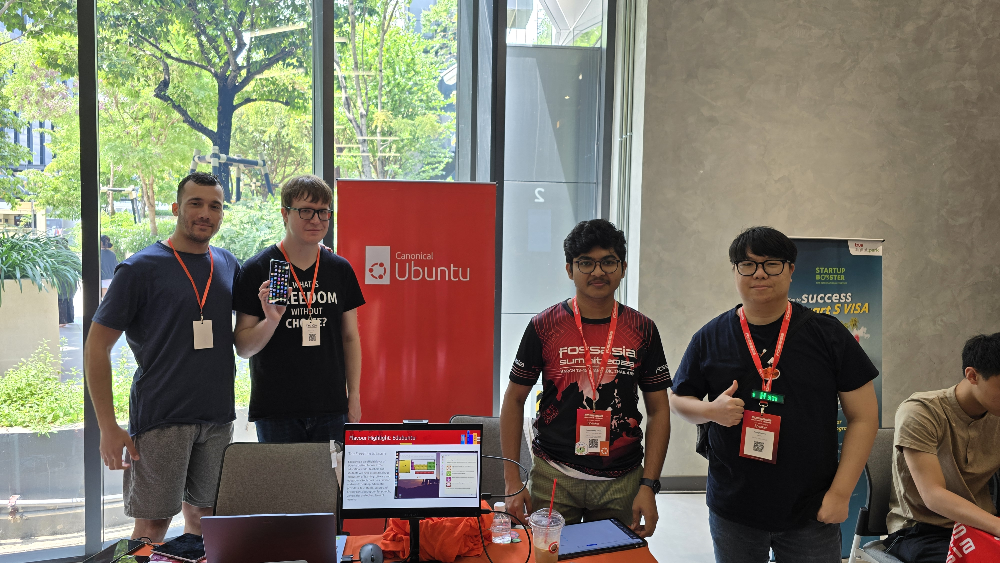
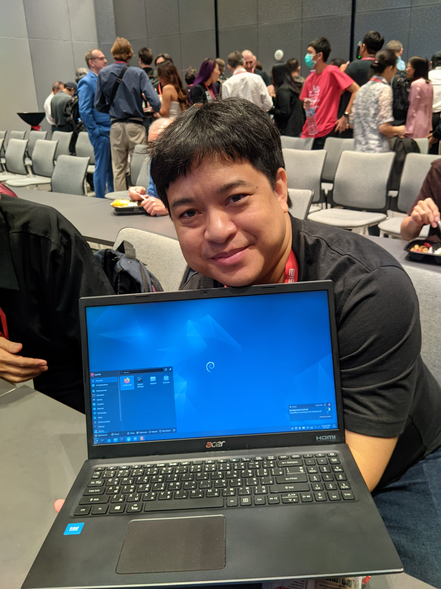
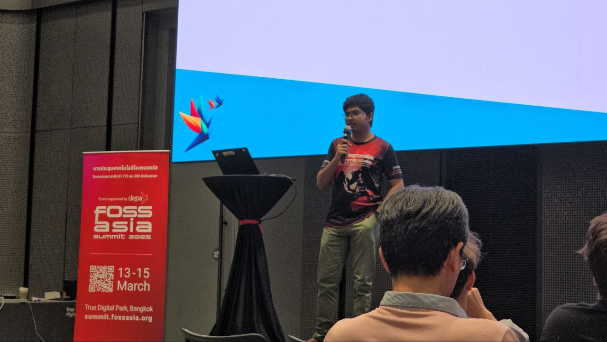

+++
title = 'Fossasia Summit 2025'
date = 2025-03-16T14:34:20+07:00
images = ["fa_banner.png"]
tags = ["FOSSASIA", "FOSS", "Ubuntu", "Snapcrafters", "Snaps", "2025", "Canonical", "Bangkok", "Linux", "Summit"]
+++

Friendly country, Friendly people, Reunions, New Experience, a bit of hustle and that's LIFE!

So, this was my 4th conference and 3rd international trip! A lot of new experiences and new friends, but let's talk about FOSSASIA Summit 2025 first.

## FOSSASIA Summit 2025

This is the first conference where I was having a lot of different tasks, lightning talk, representing Ubuntu booth and KDE booth. So, a lot of different perspectives will be here. Sometimes I'll be writing from KDE's pov, sometimes Ubuntu's and sometimes my own.

### Ubuntu booth preperations

I brought a Ubuntu printed table cloth from FOSDEM (Thanks to Gregory!). I brought that table cloth with me for this summit.

Now, you must have seen a nice and beautiful orange standee in a lot of pictures that were shared in social media? That was a centre point for our dillema, initially I thought that FOSSASIA team might help with that. Well, they just let us know which local vendors to use. So, I took up the initiative, and instead of depending on vendors outside, I contacted a local vendor, [Kraftix Digital](https://www.kraftixdigital.in/) and got a very beautiful standee at a cheap price.

_[Ubuntu Standee in my hotel room](https://mastodon.social/deck/@soumyadghosh/114143826470820117)_

I also had some spare Ubuntu stickers with me, which I brought here. [Youngbin Han](https://www.linkedin.com/in/youngbin-han/) also had a lot of left over stickers from the Ubuntu Summit 2024!

### Day 1

#### Ubuntu

We kicked off the day by setting up our booth, showcasing the versatility and robustness of Ubuntu across various platforms. The influx of attendees from diverse backgrounds led to enriching interactions, with many expressing keen interest in Ubuntu's applications.

You can find the complete day 1 report here in [Linkedin](https://www.linkedin.com/posts/soumyadghosh_orange-fossasia2025-ubuntu-activity-7306041103189782529-QbsB?utm_source=share&utm_medium=member_desktop&rcm=ACoAAEb88BYBvz0xFt2Nk4WyZerJF0FdcaAdvog) and [Ubuntu Discourse](https://discourse.ubuntu.com/t/day-1-highlight-and-event-report-from-fossasia/57092?u=soumyadghosh).

A lot of day 1 was about Ubuntu Touch, Snaps, Ubuntu's uses and all. I found a lot of booths and projects were also using Ubuntu.

There was the IO Foundation booth opposite to the Ubuntu booth. They were using Ubuntu 24.04 to showcase their work! They were having issues connecting to the venue wifi which [Ratchanan Srirattanamet](https://www.linkedin.com/in/ratchanan-srirattanamet-414946110/) helped to fix and connect. I also suggested them to use the docker snap for easy startup!

[Jerry Tan](https://www.linkedin.com/in/jerry-tan-b89a2221/) from Lattel Robotics, was roaming around the lobby with their robot that was following him and the robot was using Ubuntu 18.04! A huge shout-out to their project Jupiter Robot!

_Jerry Tan with his project Jupiter Robot_

We also got some very reddish OS folks at our Ubuntu booth!!!

_Reddish OS folks in Ubuntu booth_

#### KDE

Meanwhile our KDE booth also kicked off well! I met Xerusion over there, and together we started Day 1!

_KDE booth by Me and Xerusion_

We started getting attendees from different countries, mostly students, who tried KDE for the first time!

_Friends at KDE booth with me and Xerusion_

I also booked a slot for demoing projects of KDE which was given to every exhibitors. Sadly, before the slot for the Ubuntu booth came up, the room was almost empty. So, they kind of stopped it. But I was able to showcase KDE Connect, Krita and some other projects to the attendees during the demo for KDE. (Will attch the video soon, if I am able to upload it to youtube)

### Day 2

#### KDE

On day 2, I focused more on the KDE booth, as there was only 1 guy at the booth. I roamed around the lobby with [Xerusion](https://mastodon.social/deck/@Xerusion) with tablets showcasing different apps and products of KDE.

_Me and Xerusion talking about KDE | Image Courtesy: Youngbin Han_

We bumped onto the conversation tables, asked about their opinions, feedbacks, suggestions and also introduced a lot of people to KDE and Open Source in general. A lot of students tried KDE at our booth!

_Thai students giving KDE a shot_

#### Ubuntu

On Day 2, There was a talk by Ratchanan on [Ubuntu Touch: freedom of choices in mobile OS space](https://eventyay.com/e/4c0e0c27/session/9478), where he discussed about how the current market of Mobile OS is facing a duo-poly of Apple and Google, and Ubuntu Touch can be a great factor to reduce this duopoly.

Also, there was a workshop by Youngbin on [Building Ubuntu based Container image with Rockcraft](https://eventyay.com/e/4c0e0c27/session/9528). He demostrated the attendees how they can use rockcraft to create secure and lightweight ubuntu-based containers.

The Ubuntu booth was also a hub a for [Volla OS](https://volla.online/en/). A big shout out to the Volla team!

_Youngbin, Me, Nikita and Alexandre from Volla_

A beautiful time lapse for the Day 2 Ubuntu booth by Youngbin.



_Day 2 Time Lapse | Video Courtesy: Youngbin Han_

At the end of the conference there was a social & networking event. Registered guests were welcomed with a beautiful dance-play (we call it Nritya Natya in our language) of one of the oldest Indian Mythology, The Ramayana! It was very emotional for me to watch my own culture being celebrated by others so beautifully and respectly.

### Day 3

One certainly doesn't realise how fast a conference ends! It's feeling like, it just started and then suddenly, there comes the last day! The attendee count on day 3 was a bit less, and everyone was strolling around in the rooms and in the lobby! Although on this day, we got more visitors at the KDE booth than on the previous days!

#### KDE

I and Xerusion again took up the tablets and roamed around. We got a lot of suggestions and feature requests for KDE. We found some KDE users too. There was this guy, who was using Debian with KDE!

_Debian user with KDE installed_

#### Ubuntu & Snapcrafters

Today, I also had a lightning talk! The talk was about the GhVmCtl tool, created by Canonical's current VP Jon Seager and Marco Trevisan, [GhVmCtl: Test your GUI apps directly from CI runners](https://eventyay.com/e/4c0e0c27/session/9443).

This was my first ever lightning talk. I was pretty much excited and nervous at the same time! Even though, 5 minutes was allocated, I needed to finish my talk in just around 3 minutes :disappointed_relieved: (Will share the talk video when it's uploaded in youtube)

Sharing some snaps of that talk here

_Me explaining how we use GhVmCtl in Snapcrafters | Image Courtesy: Youngbin Han_

### Visiting Bangkok as a student

Now, I am going to share some experiences of my very own, which I didn't find anywhere in the interenet.

#### Rupay International Debit Cards

Keep some things in mind before visiting Bangkok with a Rupay International Debit card.

- You can withdraw cash pnly from Bangkok Bank and Krungsri bank atms
- Remember banks often put limits for cash withdrawal (40,000 INR in my case)
- If you try to withdraw a lot of money (like 30,000 INR in my case) you transaction might be cancelled and your money might get stuck eventually making you out of money
- Whatever the amount is, for each transaction both of the above mentioned banks deduct a sur-charge
   - Bangkok Bank: 150 Bhat
   - Krungsri Bank: 220 Bhat
- POS machines will not accept this card, even the Bangkok Bank POS machine did not accept Rupay

#### Cash and Money

Cash is king here, so, always keep cash with you. **AND DO NOT CONVERT INR TO BHAT OVER THERE!** In the airport the exchange rate was **8-10 Rupees for 1 Bhat**. So, convert your currencies in India only!

#### Public Transport

If you're on cash crunch, take public buses instead of rail link. Rail link is almost 2-3 times more expensive than the public buses. In some scenarios, the e-cab services like Grab is cheaper than rail link.

#### Food and Water

Other than local thai food, there are various type of authentic Japanese and Korean food available. Pork is the most easily found meat there. Also, fish oil is one of the essential ingredients in Thai foods. So, please be sure about your allergens. Also, make sure you always have a bottle of water with you. **DO NOT DRINK TAP WATER.** Use your bottle to refill from reputed drinking water sources (like I tried to fill my bottle from my venue) or buy them from reputed stores like 7/11. Make sure, you drink enough water everyday, as the weather is very hot and humid.

#### Language and Navigation

Thai is must when communicating with local Thai people. So, please keep Thai language installed and offline ready in your transalator app. It's a must to navigate easily. Also keep a version of offline map with you.

### Canonical's Support

Thanks a lot to Canonical for supporting my journey to FOSSASIA Summit 2025! I hope I have served the best I could to Ubuntu and the community.

### Conclusion

Finally, this was an awesome summit. I met so many people and had so much fun around! I hope I meet everyone again next year! Thanks for the warm welcome, Thailand!

A big thanks to

- Bhavani Shankar Ravindra
- Youngbin Han
- Mauro Gaspari
- Aaron J Prisk
- Ratchanan Srirattanamet
- Nikita
- Alexandre HAMAMDJIAN