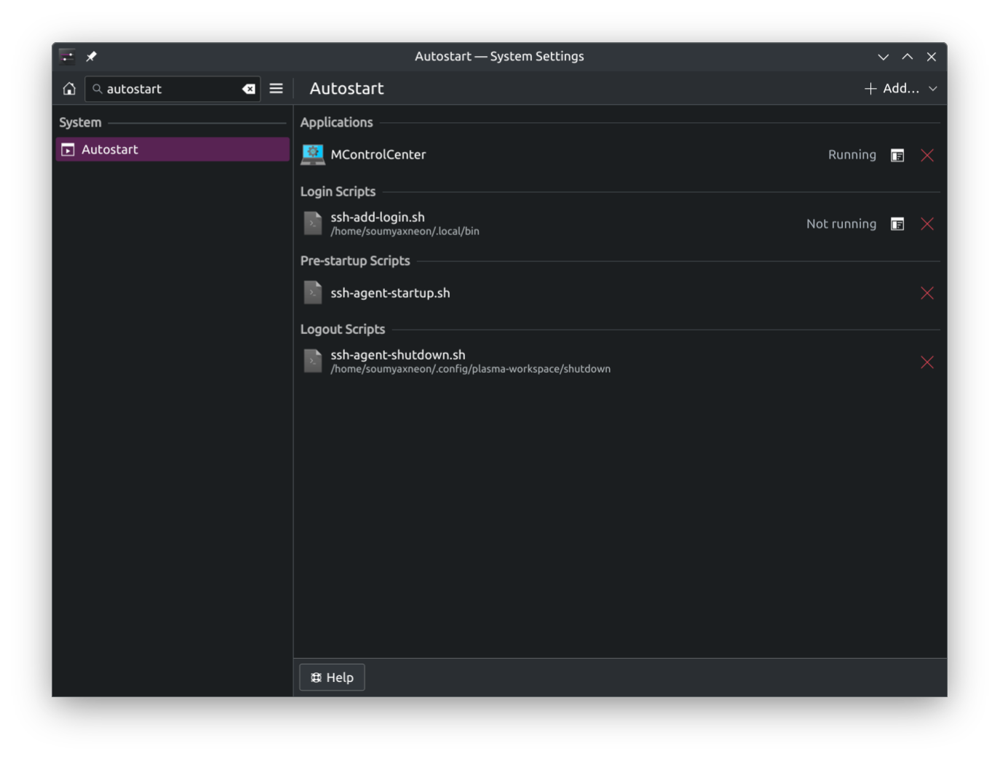

+++
date = 2024-05-15T23:50:00+05:30
title = "SSH Keys and KWallet: Getting rid of SSH asking passphrase"
tags = ['SSH', 'KDE', 'SSH-key', 'passphrase', 'linux', 'bash', 'automation']
+++

So, recently, I shifted some of my workload to kde. And I started my KDE journey with KDE Neon. Even with a 2 year old base and packages, snaps and ppas saved me. Now, one of the important part of my work was to clone the repo using ssh. And here comes the problem.

In gnome, the gnome-keyring and the seahorse would automatically manage my ssh and gpg key passphrases. But, in KDE, that didn't happen. On the starting I was getting frustrated with the ssh always asking me the passphrase. Then after a lot of reading manuals and internet searching, I found out about `ksshaskpass`. This can be used to write my passphrase and there I can set it to remember my passphrase, which it would essentially save in kwallet. So, How did I set this up?

First of all, I have to look for the ssh-agent to make it always running and also doesn't create duplicate processes. So, first I created a script in

`${HOME}/.config/plasma-workspace/env/ssh-agent-startup.sh`

```bash
#!/bin/bash
export SSH_ASKPASS="/usr/bin/ksshaskpass"

if ! pgrep -u $USER ssh-agent > /dev/null; then
    eval $(ssh-agent -s)
fi
```

What this script does is, first it export the binary path of `ksshaskpass`, so, that `ssh-add` uses it. Then, it checks if `ssh-agent` is already running. If it's not running, it runs the `ssh-agent` with the command `eval $(ssh-agent -s)`. Then I created another script, to stop the `ssh-agent` before logging out in

`${HOME}/.config/plasma-workspace/shutdown/ssh-agent-shutdown.sh`

```bash
#!/bin/sh
[ -z "$SSH_AGENT_PID" ] || eval $(ssh-agent -k)
```

This script checks if there is any value in the environment variable `SSH_AGENT_PID` which basically means it checks if `ssh-agent` is running or not. Then, runs `eval $(ssh-agent -k)`, which kills the `ssh-agent`.

After this, comes the main part. I created an autostart script that will add the key using `ssh-add` whenever I login, using the passphrase from `kwallet`.

`${HOME}/.local/bin/ssh-add-login.sh`

```bash
#!/bin/bash

# Waits for kwallet to start
kwallet-query -l kdewallet > /dev/null

# Checks for all the private keys under .ssh folder
for KEY in $(ls ${HOME}/.ssh/id_* | grep -v \.pub); do
  ssh-add -q ${KEY} </dev/null
done
```

And now comes the most important part. Open the System Settings app. Then search, `autostart`, you'll see an option like this:



In this page, click on Add => Add Login Script

Then, select the location of your script which in this case is `${HOME}/.local/bin/ssh-add-login.sh`.

And voila :tada: :smile:, your ssh key should now be automatically added to the `ssh-agent`, whenever you login.