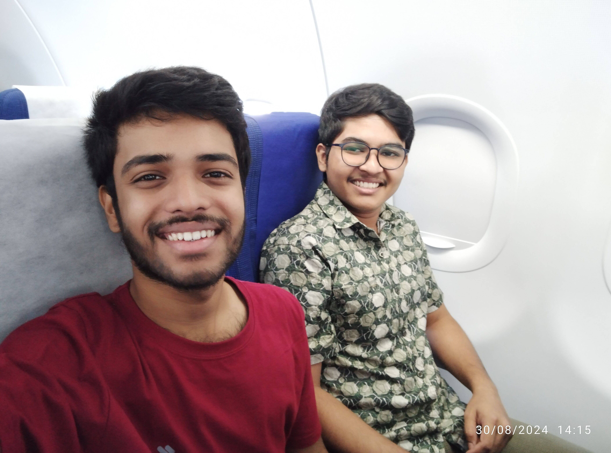
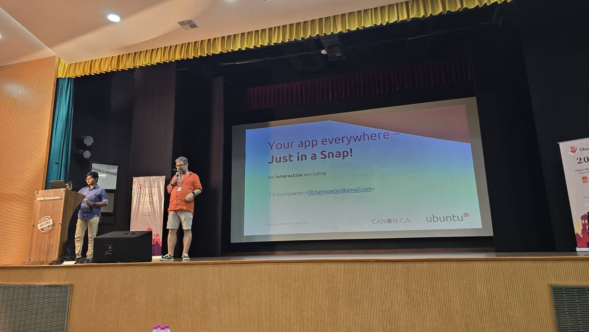

+++
date = 2024-09-13T20:30:00+05:30
title = "UbuCon Asia 2024: My first ever conference!"
tags = ['UbuCon', 'Ubuntu', 'Conference', '2024', 'Canonical' , 'Linux', 'Snaps']
+++

"Heather, Heather, Heather; what did you now!" and both me & [Fenris](https://www.linkedin.com/in/myfenris/) started laughing with Till, as we're discussing about some issue in the thunderbird snap during the conference dinner.

Yup, this is from UbuCon Asia, my

- First conference
- First flight journey
- First travel out of my state
- First solo travel out of my state
- First solo stay at a hotel

Huhhh, a lot of first timers! I can't think actually where to start with...
I met so many people out there, got so many mentors! Thanks [Till](https://github.com/tillkamppeter), for introducing me with so many mentors! I met [Guruprasad sir](https://www.linkedin.com/in/lguruprasad/) (the launchpad guru :smile:), [Kierthana mam](https://www.linkedin.com/in/keirthanats/) and [Dimple didi](https://www.linkedin.com/in/dimple-kuriakose/) (both are the documentation gurus). A lot of suggestions, tips, guides from them! Thanks a lot :face_holding_back_tears:! BTW, How can I forget my OG [Bhavani](https://www.linkedin.com/in/shankarbhavani/) bhaiyaa!

OG meeting the Launchpad Guru

So, let's start with the journey. My flight was on 30th August, around 2:40PM. Being my first flight journey, I was a bit nervous about it. But, the process went smoothly. Also [Ronit da](https://www.linkedin.com/in/ronitbanerjee/) helped me a lot during the onboarding.

Me and Ronit da in the flight to Jaipur

The next day comes 31 August, the day of the conference. Thanks to Till, a lot of the setups for the booth were already done before hand, like the setup for a TV and tables etc. We reached the venue around 8:45AM, and set up our booth. After we're done, people started coming up and asking about things. And there in an Arch guy's laptop, I installed `snapd` and the first snap I showed him was [`tldr`](https://snapcraft.io/tldr).

Me, Till and [Venkatesh](https://www.linkedin.com/in/blaster4385/)(the arch guy) with the `tldr snap` command in his lappy's terminal

The booth became slowly became a point of attraction. For everyone coffee breaks were breaks, but for me it was the most busiest time, with people coming up with full of enthusiasm, asking about Linux, Ubuntu, Snaps etc. We also got CDAC people there, whom I explained how snaps can solve maintainenance issue for them, with thousands of packages from various releases and also the permission management in snaps.

Me telling Srijan bhaiyaa why the slide says "What the Hell are snaps" while Till is giving the talk, ([Heather](https://github.com/hellsworth) again!)

The next day, we're busy with the snap workshop. Till suggested that we surprise everyone, that it's not gonna be only him, it's gonna be us, but time crunch! We needed to hurry with everything. There were a lot of last moment setups, like reimplementing all the examples with cli based apps due to internet issue, small nitpicks and all. It was kind of a trial for us, which we'll again do during the summit. And the trial went awesome!

Till starting the workshop

Me explaining a bit on the snap workshop

There was also conference dinner at the end of the conference day and a trip a next day. A lot of ups and downs, late startings, technical issues but all is well that ends well. And it ended very well.

Thanks a lot Canonical, for giving me this opportunity and sponsoring my journey. It has been a thrilling and lovely experience, that I'd always cherish.

Also, I must mention

- [Merlijn Sebrechts](https://github.com/merlijn-sebrechts)Thanks a lot for believing in me and letting me lead the beacon of [Snapcrafters](https://snapcrafters.org/).

- [Mauro Gaspari](https://www.linkedin.com/in/mauro-gaspari-83a30168/)Thanks a lot for helping me with the sponsorship and booth.

Thank you everyone!

