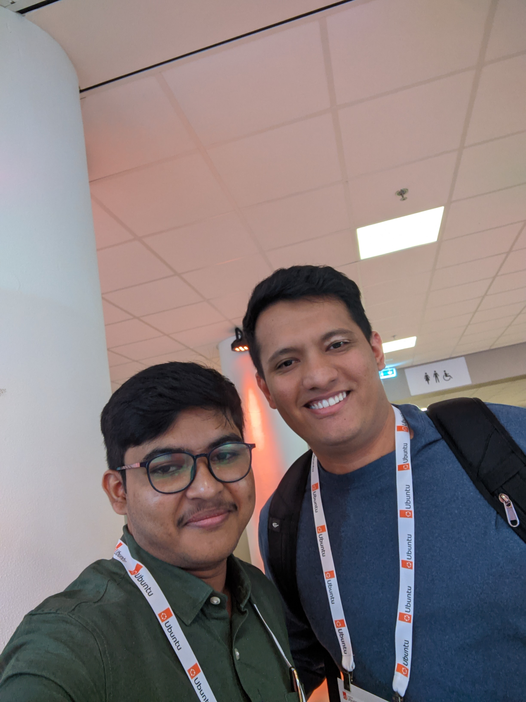

+++
title = 'Ubuntu Summit 2024: A joyful experience filled with sorrow'
date = 2024-11-09T13:05:00+05:30
images = ["ubuntu_summit.png"]
tags = ['Ubuntu Summit', 'Summit' , 'Ubuntu', 'Conference', '2024', 'Canonical' , 'Linux', 'Snaps', 'The Hague', '20 Years of Ubuntu'] 
+++

Has this ever occurred to you? The most joyful moments of your life got filled with sorrow, a grief of loss...

Let's talk about the Ubuntu Summit first, my international conference and solo travel outside my country. Probably I am the first from my entire extended family to visit a European country. My parents, well-wishers everyone was so happy. Only person didn't know much about this, my maternal grandfather, whom I called (yes, "called", he left us on 27th October 2024) **Dada**. Let me tell you about the summit first.

## Ubuntu Summit 2024

An exciting journey started from the time when I started my visa application process. A very hectic process, as it's my first time applying for a visa. The process went almost smoothly, except minor problems... 

### 23rd October

The day came, for my flight towards Doha and there to Amsterdam. Luckily, I booked my flight which was the early morning of 23rd, 3:00AM... because there was a cyclone predicted on that day, and many flights were delayed and cancelled for that. A very tiring long journey to Amsterdam, 12+ hours of flight. At evening, I finally met the most charming guy who doesn't work in charmcraft. It was pleasant to meet Mauro, Aaron and Aryan Porwal bhaiyaa for the first time!!

_The whole community team and extended community team_


_Thanks for helping me cut my pizza Nucci_ :smile:

### 24th October

Finally comes, team Snapcrafters. Merlijn, Anne, Lucy. And ofcourse other teams too, Thunderbird, Linux Gaming, Lutris, Ubuntu Budgie, Openprinting... all united. Also met the Ubuntu Touch team that morning.

### Day 1

Our booth started...so busy at the booth, I even forgot to have lunch!!! But never mind, first day, the setup was also awesome. Unfortunately, I forgot to take any picture of our booth. (If someone has any, please share with us, it'd be awesome!)

We got many many questions, like:

1. What is Snapcrafters?
2. Is this related to Canonical?
3. Am I a Canonical employee?

(Ignore 2 and 3 :sweat_smile:)

People asked about us, snaps and of course, what we do and how we're helping the community to grow. We also started discussions with our next neighbour, the Linux Gaming booth about a potential snap for Lutris and Heroic. And Day 1 ends here... with an awesome dinner with Liam and Till...

BTW, I met my friend Eduardo for the first time! Thanks a lot Eduardo for attending the conference and keeping my request.

### Day 2

And here comes Day 2, a very exciting one! I attended the talk about the KDE Neon Core by Dr. Kevin Ottens(Kevin, I am very sorry for the unpleasant questions, I asked :disappointed:). Got an overview about how the project is going on, and how we can contribute. Needed to come back to the booth, as we needed to prepare for our first workshop,

[Crafting Snaps Quickstart Guide](https://events.canonical.com/event/51/contributions/586/)

Merlijn and I presented it in front of many different attendees, and I was really surprised and glad by the enthusiasm among everyone about snaps.(Well, snaps are awesome...) Till, Heather, Sergio, Zyga and many others helped the attendees during their turn, when they were trying to do [Snapping Like Hell!](https://events.canonical.com/event/2/contributions/15/). Posted by [Zyga in Mastodon](https://fosstodon.org/@zygoon/113374271774528257)

_Me and Merlijn starting the Hello World Gtk example, Picture courtesy @Zyga_

With the Linux Gaming team I tried to hack into the Heroic snap, but we just tried to hack our internet to get better speed :disappointed_sweat:

_Me, Thomas, Mathieu, Luke, Powell, Kelvin and Mathis during the Hackerspace_

### Day 3

Another day, another busy schedule. Me and Merlijn had another workshop on day 3, it was regarding using the [CI of Snapcrafters](https://github.com/snapcrafters/ci) for their snap project management. The workshop was very appealing for many. Many tried to setup things and we also got many visits regarding the CI in our booth. And Day 3 ended with the awesome party!!! 

A lots and lots of awesome, beautiful, funny memories I'll cherish for a long time.

## The Loss

Many knew that my grandfather was sick, needed to be hospitalized twice this year. He seemed to be good before I left the country. I returned to India, on 29th October, morning around 10AM(IST) and reached home by 12PM. The lightning struck me, when my mom tells me, "Dada aar nei" (en: Grandpa is no more). I wasn't able to process it... What? When!! 

On 27th October, around 7:15AM(IST), he breathed his last breath. I tried to bury myself into work, tried to learn more about programming with the suggestions from Eduardo, dug deep into the Kirigami framework and apps, but still... deep down, it felt very sad, very alone. A deep regret that I wasn't able to see him for the last time. Yesterday, 08th October, we performed his last rites with the Vedic customs and Bengali rituals, there was a small prayer on the Ramayana staged at our home at the evening. All these helped me a lot to understand the fact that "Man is immortal". One who borns, must die. I just pray, that he gets peace through the cycle of birth and death. Om Shanti.

_The Shraddh Ceremony, Hindu rituals performed after someone's death_

## Thank you

Thank you so much, my friends for all the supports you gave me, for all the happy memories, for the joyful things, I'll cherish forever. Thank you, Thank you so much!

_Memories I will always cherish_
