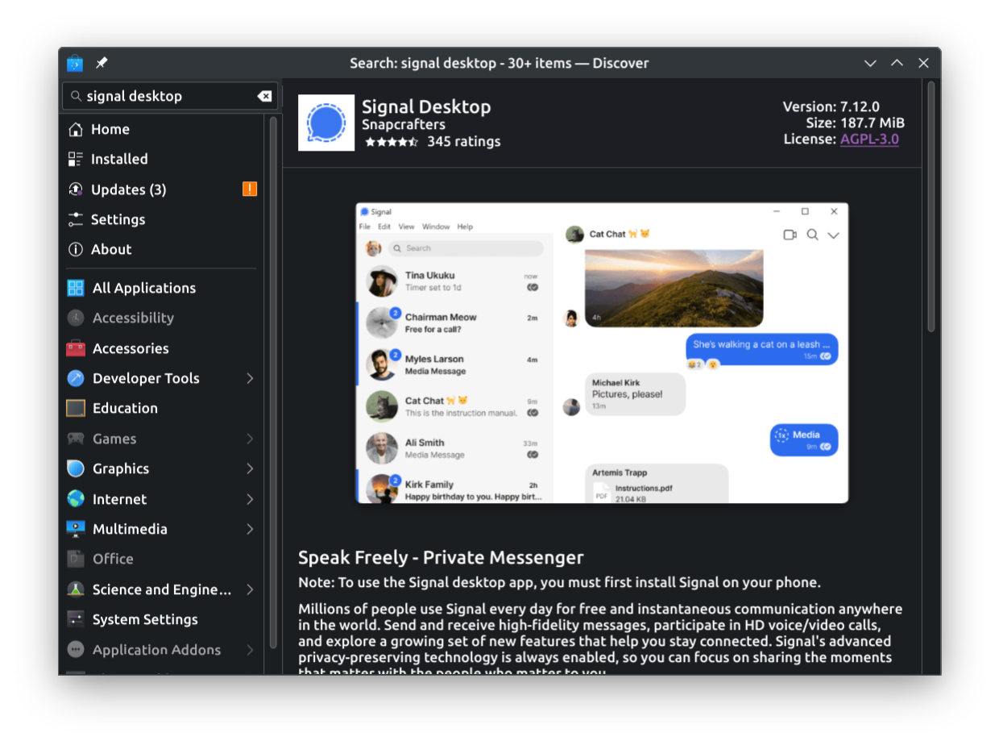

+++
title = 'GSOC Week 1 Week 2'
date = 2024-06-15T00:07:37+05:30
images = ['gsoc.png']
keywords = ['KDE', 'Discover', 'GSOC', '2024']
tags = ['KDE', 'GSOC', '2024']
+++

This is the first blog post of my GSOC journey. I will be sharing my works and experiences here. Stay tuned for more updates. In this blog, I'll be sharing my experiences of the first two weeks of GSOC, what are the works I did, what are challenges I faced and how did I overcome them ( Did I really overcome them :P ).

On my first week I tried to understand the codebase of discover first, via doing small changes. So, the first thing I added was a new way of verification of snap publishers which is officially supported by snapcraft. Snapcraft has two tiers of verification:

1. Verified Account (Used for big organizations like KDE, Microsoft, Google, etc)
2. Star Developer (Used for small organizations and individuals)

I added that via an easy `switch` case, making it my first PR to discover. How does it look now? Here is a screenshot:

| Before the changes                     | After the changes                         |
| :------------------------------------: | :---------------------------------------: |
|  |      |

Noticed the star :star:?

The next thing was actually the main challenge for me. Currently, discover didn't give users any option about the channels of the snaps before installing it, which added some extra clicks and some extra headaches to the users who wanted to use the snaps from a channel which is not `stable`. Now, first challenge was to make the `channels` button showup even when the snap is not installed. I fixed it by setting by setting the

```js
visible: view.count > 1
```
Where `view.count` is the number of channels available. Then, added a new variable named `m_channel` which by default has the value `latest/stable` and will change based on the channel selected by the user. It's changed using the setter function `setChannel`. And this is how it works now!



On another side, what'll be the use of these if the snaps aren't great to use in KDE? That's why I also started to work on the sdk of the snaps. 

The Qt SDK for Snaps didn't have proper Multimedia codecs and PulseAudio support. I fixed that. While doing these we also found out a bug in the build of the SDK. It's fixed by my mentor Scarlett Mam. Also, on updating some snap packages, which were not at all up to date including KClock and KWeather. Also worked on the snaps of AudioTube, Haruna and some others. The Work is still in Progress. So, stay tuned.

Thanks a lot to everyone who helped me in this journey. Also a big thanks to
1. [Scarlett Mam](https://invent.kde.org/scarlettmoore)
2. [Aleix Pol](https://invent.kde.org/apol)
3. [Nate Graham](https://invent.kde.org/ngraham)
4. [Fyodor Sobolev](https://github.com/fsobolev)

Stay Tuned for the future updates. Also, if you want to have a technical details and deep dive into my PRs and changes, there will be a blog coming soon explaining all that. So, please keep an eye on my blogs! Good Bye :wave: