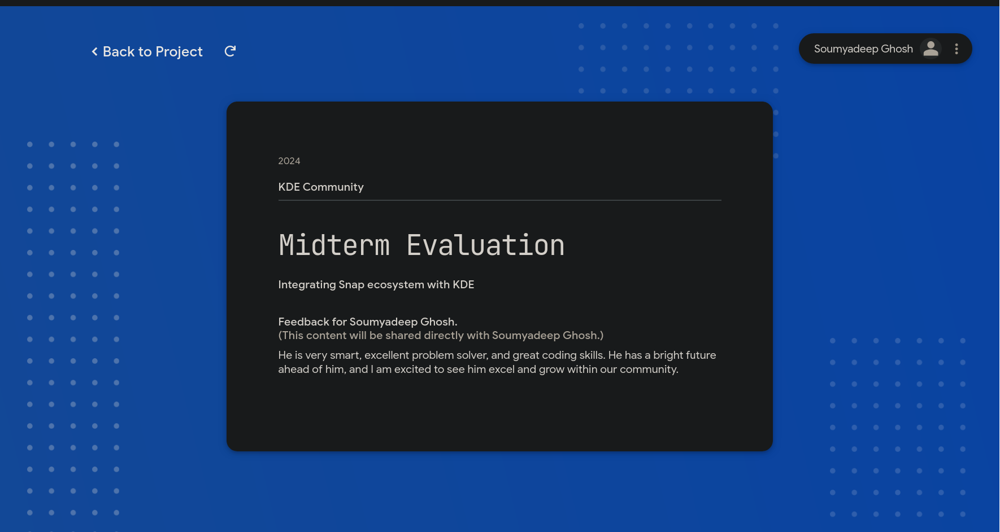

+++
title = "GSOC: Accident Week!"
date = 2024-07-20T17:04:00+05:30
images = ['gsoc.png']
keywords = ['KDE', 'Discover', 'GSOC', '2024']
tags = ['KDE', 'GSOC', '2024']
+++

Yes, that's right. The title just goes perfectly, with these long weeks! From Week 3 to Week 7!

So, first a small back story on the title. On 25th June, my semester exam ended. I was returning to my hometown, and on my way, I got into a bike accident. My right hand got bruised onto the road. Luckily, it didn't break. But, the sheer pain was enough to make me cry. It was feeling, as if, someone is constantly burning my hand. I also got injuries in my leg and chest. Went to the doctor, a day after, because I wasn't able to get up at all! And a complete bed rest for 2 weeks! And guess what, everything good after that? No!!!! My mentor, Scarlett mam, faced a road accident. And this time, she got her arm broken. She had her surgery yesterday. To every readers of this blog, please pray for her speedy recovery.

Now, let's come to the work part. Most of the things done in these weeks are behind the back, and into the backends. Like, improving the metadata of snap listings and expanding the snapd-glib API to include all available links provided by snapd, as well as exposing previously inaccessible URLs via the API for discover. The work on the snap_kcm, which is meant to manage the permissions of Snaps in KDE, has started. The backend already exposes all the connections, a snap has. There are some PRs that are already existing, for everyone to checkout.
1. [api: expose all the possible links exposed by snapd](https://github.com/snapcore/snapd-glib/pull/161)
2. [snap: expose website and storeUrl link](https://invent.kde.org/plasma/discover/-/merge_requests/874)
3. [Draft: snap: use the PrivilegedDesktopLauncher dbus](https://invent.kde.org/plasma/discover/-/merge_requests/876)

During all these problems, Scarlett Mam, took the time to evaluate my works and she had passed me! Thanks a lot mam, for your kind words! Those mean a lot to me. I am very grateful to you for the chances you gave me, for believing me!

These weeks have been very tough, challenging and busy for me. But, I somehow managed it, which I got from my mentor. Afterall, managing 200+ snaps at the same time, isn't a small thing.

Thanks a lot to everyone who helped me in this journey. Also a big thanks to

1. [Scarlett Mam](https://invent.kde.org/scarlettmoore)
2. [Aleix Pol](https://invent.kde.org/apol)
3. [Nate Graham](https://invent.kde.org/ngraham)
4. [Fyodor Sobolev](https://github.com/fsobolev)
5. [Nick Logozzo](https://github.com/nlogozzo)

Stay Tuned for the future updates. Also, if you want to have a technical details, please deep dive into my PRs and changes. Good Bye :wave: